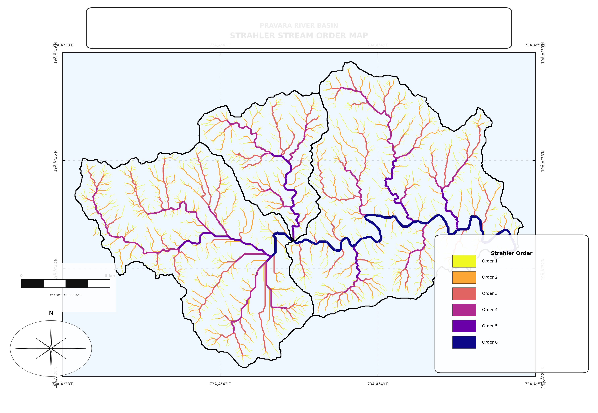
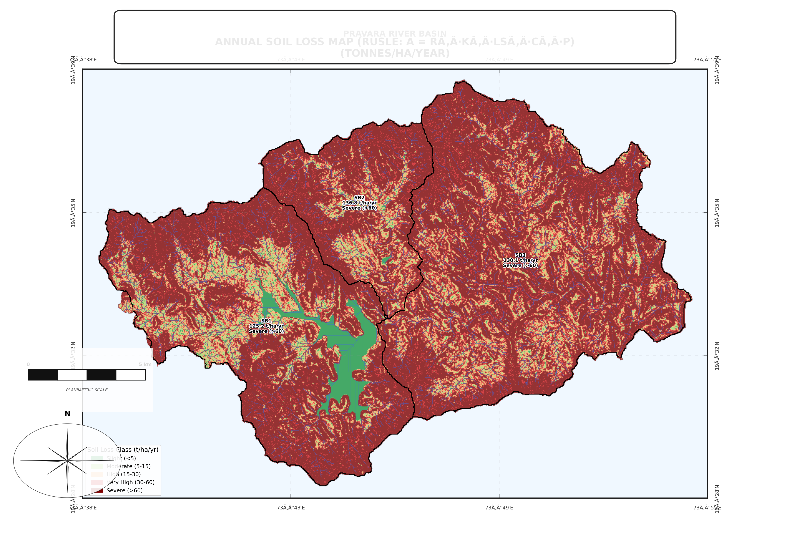
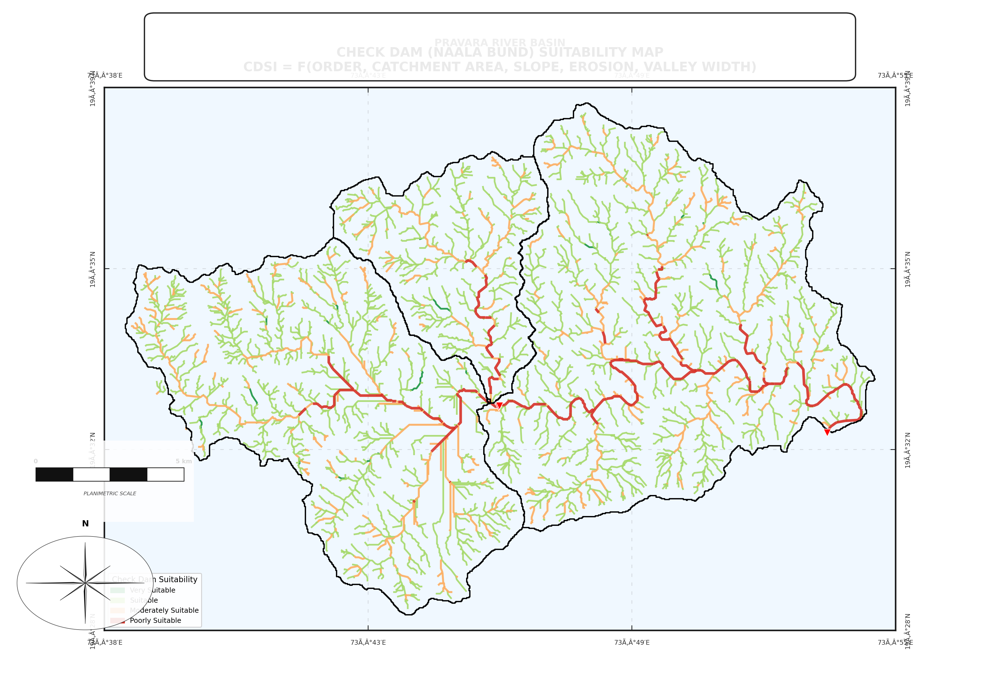
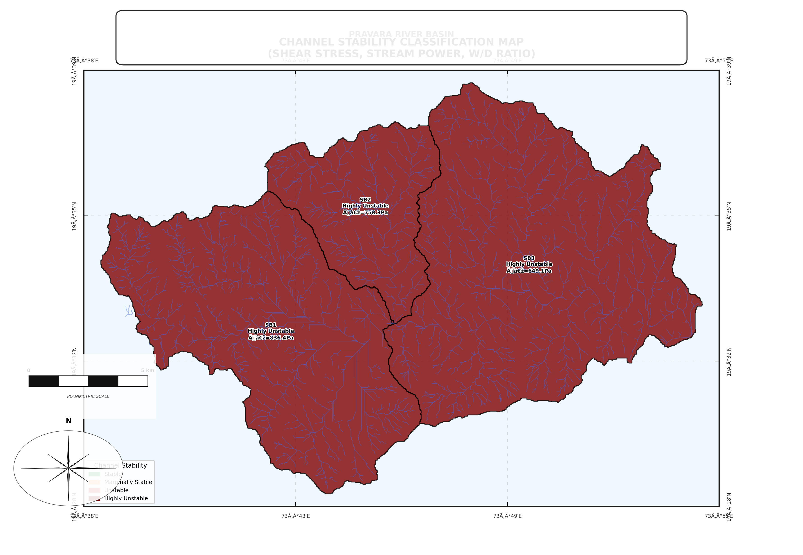
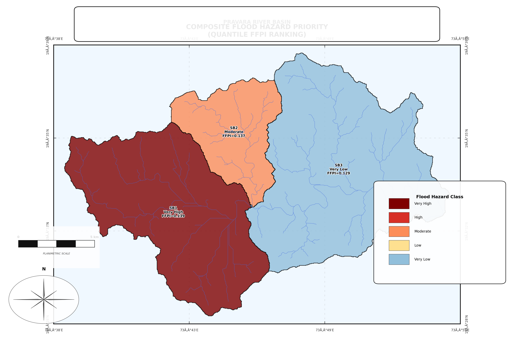
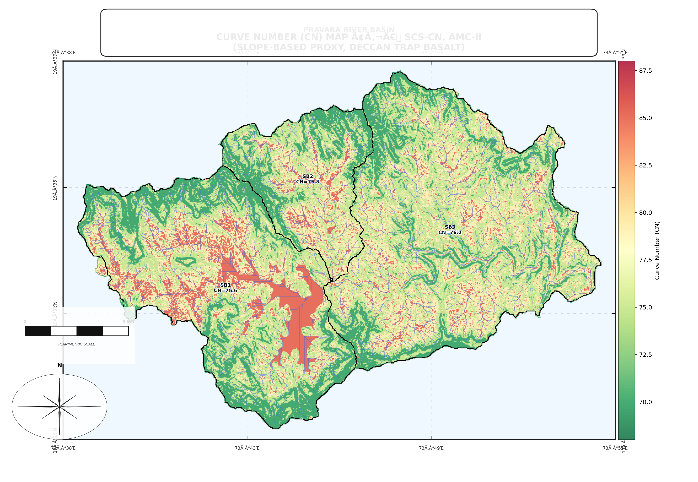
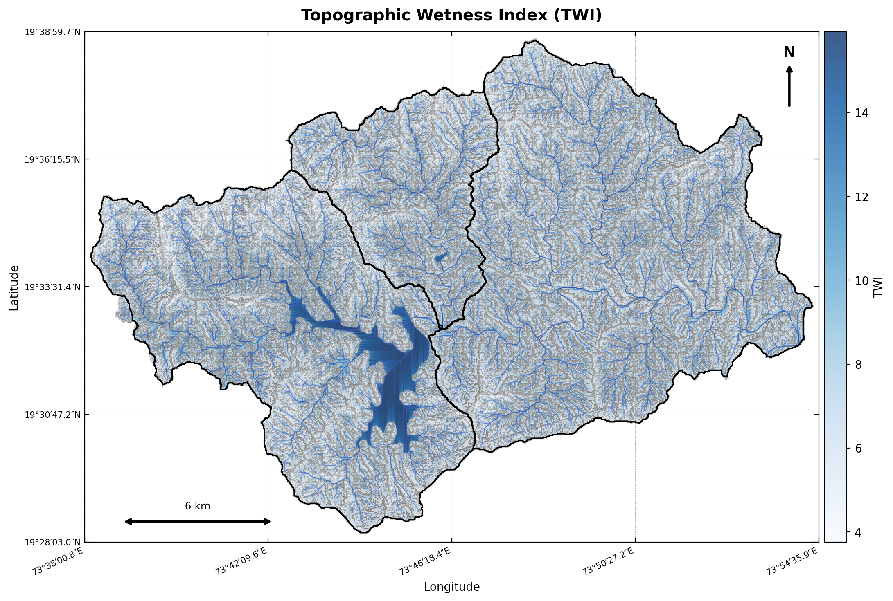
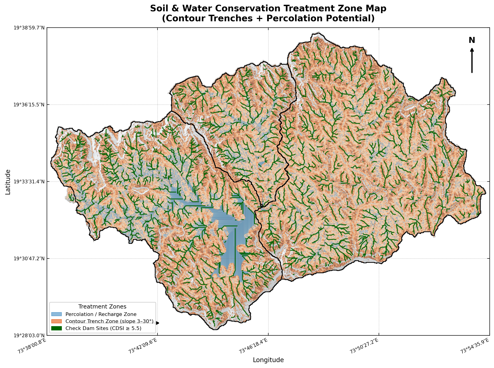

<div align="center">

<br>

```
  ██████╗ ██████╗  █████╗ ██╗   ██╗ █████╗ ██████╗  █████╗
  ██╔══██╗██╔══██╗██╔══██╗██║   ██║██╔══██╗██╔══██╗██╔══██╗
  ██████╔╝██████╔╝███████║██║   ██║███████║██████╔╝███████║
  ██╔═══╝ ██╔══██╗██╔══██║╚██╗ ██╔╝██╔══██║██╔══██╗██╔══██║
  ██║     ██║  ██║██║  ██║ ╚████╔╝ ██║  ██║██║  ██║██║  ██║
  ╚═╝     ╚═╝  ╚═╝╚═╝  ╚═╝  ╚═══╝  ╚═╝  ╚═╝╚═╝  ╚═╝╚═╝  ╚═╝
                  RIVER BASIN ANALYSIS
```

<h1>Pravara River Basin</h1>
<h3>Advanced Morphometric & Hydrological Analysis Pipeline</h3>

<p><em>Godavari Sub-basin · Ahmednagar District · Maharashtra · India</em></p>

<br>

<!-- Badges Row 1 — Tech Stack -->
[](https://python.org)
[](https://jupyter.org)
[](https://colab.research.google.com)
[](https://geopandas.org)
[](https://rasterio.readthedocs.io)
[](https://plotly.com)

<!-- Badges Row 2 — Project Stats -->
[](docs/)
[](docs/PARAMETERS_REFERENCE.md)
[](outputs/maps/)
[](outputs/html/)
[](LICENSE)
[](#)

<br>

---

### 🧭 Navigate This Repository

[**🗺️ Maps Gallery**](outputs/maps/README.md) &nbsp;·&nbsp;
[**📊 Interactive Charts**](outputs/html/README.md) &nbsp;·&nbsp;
[**📋 Full Results**](docs/RESULTS.md) &nbsp;·&nbsp;
[**📐 Parameters Reference**](docs/PARAMETERS_REFERENCE.md) &nbsp;·&nbsp;
[**📂 Data Guide**](docs/DATA_REQUIREMENTS.md) &nbsp;·&nbsp;
[**📖 Methodology**](docs/#methodology)

</div>

---

## 🌍 What Is This?

A **production-ready, end-to-end watershed analysis pipeline** for the **Pravara River Basin** — a Godavari sub-basin in Maharashtra, India. Built entirely in Python and designed to run on Google Colab with a single zip file upload.

The pipeline covers **18 sequential sections** across three thematic modules:

| Module | Sections | What It Does |
|--------|----------|-------------|
| 🔵 **Core Morphometry** | 0 – 9 | 60+ basin shape, drainage and relief parameters, publication maps, statistical analysis, watershed prioritization |
| 🟠 **Geomorphic & Tectonic** | 10 – 13 | Tectonic activity indices, SL gradient, TWI/SPI rasters, flood hazard composite |
| 🟢 **Hydrology & SWC** | 14 – 18 | SCS-CN runoff, RUSLE erosion, conservation planning, unit hydrographs, channel hydraulics |

---

## 📍 Study Area at a Glance

<table>
<tr>
<td>

| | |
|--|--|
| 🌊 **River** | Pravara (Godavari sub-basin) |
| 📍 **District** | Ahmednagar, Maharashtra |
| 📐 **Total Area** | **312.15 km²** |
| 🏔️ **Elevation Range** | 584 – 1 537 m (relief 953 m) |
| 🌧️ **Mean Rainfall** | ~750 mm/yr (semi-arid) |
| 🪨 **Geology** | Basaltic Deccan Traps |
| 🗺️ **CRS** | UTM Zone 43N (EPSG:32643) |
| 📡 **DEM** | SRTM 30 m |

</td>
<td>

| Subbasin | Area | Max Order | Priority |
|:---:|---:|:---:|:---:|
| **SB1** | 116.99 km² | 6 | 🔴 1st |
| **SB2** | 45.19 km² | 5 | 🟡 2nd |
| **SB3** | 149.97 km² | 6 | 🟢 3rd |
| **3 610** stream segments | | | |

</td>
</tr>
</table>

---

## 🗺️ Map Highlights

> **26 maps generated at 300 DPI** · Full gallery → [`outputs/maps/README.md`](outputs/maps/README.md)

<table>
<tr>
<td align="center" width="25%">

**Stream Order Network**



Orders 1–6 · 3 610 segments
*Section 4*

</td>
<td align="center" width="25%">

**RUSLE Soil Loss**



Mean **168 t/ha/yr** · Severe class
*Section 15*

</td>
<td align="center" width="25%">

**Check Dam Suitability**



73.8% network Suitable+
*Section 16*

</td>
<td align="center" width="25%">

**Channel Stability**



All basins Highly Unstable
*Section 18*

</td>
</tr>
<tr>
<td align="center">

**Flood Hazard Composite**



FFPI + TWI + morphometry
*Section 13*

</td>
<td align="center">

**Curve Number Map**



CN 70–85 · Mean 76.2
*Section 14*

</td>
<td align="center">

**TWI — Wetness Index**



Mean 6.8–7.7 · Max 24.8
*Section 13*

</td>
<td align="center">

**SWC Treatment Zones**



Percolation · Trenches · Check dams
*Section 16*

</td>
</tr>
</table>

*➡️ [View all 26 maps with full descriptions →](outputs/maps/README.md)*

---

## 📊 Interactive Charts

> **27 Plotly HTML charts** — open locally in any browser · Full index → [`outputs/html/README.md`](outputs/html/README.md)

<table>
<tr>
<td align="center" width="33%">

### 🌊 Flood Frequency Curves
[`14c_flood_frequency_curves.html`](outputs/html/14c_flood_frequency_curves.html)

Return period vs. Qp & Q for all basins.
Qp₂₅ reaches **1 736 m³/s** (SB3)

</td>
<td align="center" width="33%">

### 📈 Synthetic Unit Hydrographs
[`17b_synthetic_unit_hydrographs.html`](outputs/html/17b_synthetic_unit_hydrographs.html)

Full Q–t curves for 10/25/100-yr events.
W₅₀ = 6.6–9.7 hr · tp = 5.1–7.3 hr

</td>
<td align="center" width="33%">

### ⚡ Stream Power & Shear Stress
[`18c_stream_power_hydraulics.html`](outputs/html/18c_stream_power_hydraulics.html)

ω by order: 11.8 → **189 W/m²**
τ₀ = 2 400–3 125 Pa (250× τ_critical)

</td>
</tr>
<tr>
<td align="center">

### 🌱 RUSLE Erosion Analysis
[`15c_RUSLE_erosion_bars.html`](outputs/html/15c_RUSLE_erosion_bars.html)

Per-basin A vs. sediment yield bars.
Total: **1.21 million t/yr**

</td>
<td align="center">

### 🎯 Morphometric Radar
[`02_radar_morphometric.html`](outputs/html/02_radar_morphometric.html)

Multi-parameter basin comparison.
SB1 clearly most degraded

</td>
<td align="center">

### 🔄 Parallel Coordinates
[`09_parallel_coordinates.html`](outputs/html/09_parallel_coordinates.html)

All 21 parameters across basins.
Drill into any axis interactively

</td>
</tr>
</table>

*➡️ [View all 27 interactive charts →](outputs/html/README.md)*

---

## 🔑 Three Headline Findings

<table>
<tr>
<td align="center" width="33%">

### ⚠️ Severe Erosion Basin-wide

All 3 subbasins classified **Severe** under USDA RUSLE.

> **168 t/ha/yr** mean soil loss
> **33×** India's tolerable limit (5 t/ha/yr)
> **1.21 Mt/yr** leaves the catchment

→ [Full RUSLE results](docs/RESULTS.md#rusle-soil-erosion)

</td>
<td align="center" width="33%">

### 🔴 Highly Unstable Channels

Stream shear and power far exceed critical thresholds.

> **τ₀ = 2 400–3 125 Pa** (τ_c = 10 Pa)
> **ω = 7 000–8 600 W/m²** (ω_c = 35 W/m²)
> W/D ratio 20–22 → active widening

→ [Full hydraulics results](docs/RESULTS.md#channel-hydraulics)

</td>
<td align="center" width="33%">

### 💡 High Conservation Potential

Significant opportunity for water harvesting and treatment.

> **21.76 Mm³** WHP at 25-yr event
> **73.8%** of stream network Suitable+ for check dams
> **SB1** = Priority 1 across all 3 ranking methods

→ [SWC planning results](docs/RESULTS.md#conservation-planning)

</td>
</tr>
</table>

---

## 🏗️ Pipeline Architecture

```
                        ╔══════════════════════════════════════════╗
                        ║      PRAVARA BASIN ANALYSIS PIPELINE      ║
                        ╠══════════════════════════════════════════╣
                        ║                                          ║
  ┌──────────────┐      ║  SEC 00  Zip Extraction & Discovery      ║
  │  INPUT DATA  │ ──▶  ║  SEC 01  Environment & Library Setup     ║
  │              │      ╠══════════════════════════════════════════╣
  │ Filled DEM   │      ║  ┌─ CORE MORPHOMETRY ─────────────────┐ ║
  │ Flow Dir     │      ║  │ 02  Data Loading & DEM Processing   │ ║
  │ Flow Acc     │      ║  │ 03  60+ Morphometric Parameters     │ ║
  │ StreamOrder  │      ║  │ 04  15 Publication Maps @ 300 DPI   │ ║
  │ Pourpoints   │      ║  │ 05  PCA · Correlation · Clustering  │ ║
  │ Basin Poly   │      ║  │ 06  3-Method Prioritization         │ ║
  └──────────────┘      ║  │ 07  12 Interactive Plotly Charts    │ ║
                        ║  │ 08  CSV · Excel · Shapefile Export  │ ║
                        ║  └─ 09  Automated Report Generation    │ ║
  ┌──────────────┐      ╠══════════════════════════════════════════╣
  │  OUTPUT      │      ║  ┌─ GEOMORPHIC & TECTONIC ────────────┐ ║
  │              │      ║  │ 10  Tectonic Activity Indices (IAT) │ ║
  │ 26 PNG Maps  │      ║  │ 11  SL · SPI · STI · TWI Rasters   │ ║
  │ 27 HTML      │      ║  │ 12  Geomorphic Anomaly · Sinuosity  │ ║
  │ 18 CSV tables│ ◀──  ║  └─ 13  Flood Hazard Composite Score  │ ║
  │ 15 GeoTIFFs  │      ╠══════════════════════════════════════════╣
  │ 5 Shapefiles │      ║  ┌─ HYDROLOGY & SWC ─────────────────┐ ║
  │ 67.5 MB .zip │      ║  │ 14  SCS-CN · Gumbel · Tc · Qp     │ ║
  └──────────────┘      ║  │ 15  RUSLE  A = R·K·LS·C·P         │ ║
                        ║  │ 16  CDSI · Percolation · WHP       │ ║
                        ║  │ 17  Snyder UH · SCS Dimensionless  │ ║
                        ║  └─ 18  Bankfull · τ₀ · ω · Stability │ ║
                        ╚══════════════════════════════════════════╝
```

---

## ⚡ Quick Start

### Google Colab (Recommended)

```python
# 1. Clone
!git clone https://github.com/<your-username>/pravara-basin-morphometry.git
%cd pravara-basin-morphometry

# 2. Install
!pip install -r requirements.txt --quiet

# 3. Upload your zip to Colab /content/ then run:
%run scripts/section_00_zip_extraction.py
%run scripts/section_01_environment.py
# ... continue 02 → 18 sequentially
```

[](https://colab.research.google.com/github/<your-username>/pravara-basin-morphometry/blob/main/notebooks/Adv_v2__Final_morphometry_pravrabasin.ipynb)

### Local Python

```bash
git clone https://github.com/<your-username>/pravara-basin-morphometry.git
cd pravara-basin-morphometry
pip install -r requirements.txt
# Place your GIS data in data/ directory
python scripts/adv_v2_morphometry_pravra3basin.py
```

### Input Files Required

| File | Type | Description |
|------|------|-------------|
| `Filled DEM.tif` | Raster | Hydrologically filled SRTM 30 m DEM |
| `Flow Direction.tif` | Raster | D8 flow direction |
| `FlowAccumilation.tif` | Raster | D8 flow accumulation |
| `SteamOrder.shp` | Vector | Stream network (field: `grid_code`) |
| `Pourpoints_3.shp` | Vector | 3 pour-point outlets |
| `Pravrabasin.shp` | Vector | Subbasin polygons |

→ [Full data guide](docs/DATA_REQUIREMENTS.md)

---

## 📂 Repository Structure

```
pravara-basin-morphometry/
│
├── 📄 README.md                    ← You are here
├── 📄 requirements.txt             ← Python dependencies
├── 📄 .gitignore · .gitattributes
├── 📄 LICENSE · CHANGELOG.md · CONTRIBUTING.md
│
├── 📂 scripts/                     ← Python source code
│   ├── adv_v2_morphometry_pravra3basin.py   ← Sections 0–13 (4 367 lines)
│   ├── sections_14_18_hydrology_swc.py      ← Sections 14–18 (1 770 lines)
│   └── section_00_zip_extraction.py … section_18_hydraulics.py
│
├── 📂 notebooks/
│   └── Adv_v2__Final_morphometry_pravrabasin.ipynb
│
├── 📂 data/                        ← GIS inputs (use Git LFS for large files)
│   ├── Morphomtery_layers-Final.zip
│   └── README.md
│
├── 📂 outputs/
│   ├── maps/                       ← 📸 26 PNG maps @ 300 DPI
│   │   └── README.md               ← 🗺️  MAPS GALLERY ← start here
│   ├── html/                       ← 📊 27 Interactive Plotly charts
│   │   └── README.md               ← 📊 CHARTS INDEX ← explore here
│   ├── tables/                     ← 18 CSV result tables
│   ├── hydrology/                  ← Sections 14–18 CSVs
│   ├── conservation/               ← SWC planning outputs
│   ├── unit_hydrograph/            ← UH plots & params
│   ├── shapefiles/                 ← 5 GIS exports
│   ├── *.tif                       ← 15 derived GeoTIFF rasters
│   └── README.md                   ← Output index
│
├── 📂 docs/
│   ├── RESULTS.md                  ← 📋 FULL RESULTS TABLE ← all numbers
│   ├── PARAMETERS_REFERENCE.md     ← All 60+ parameter definitions
│   ├── DATA_REQUIREMENTS.md        ← Input file specs
│   ├── RESULTS_INTERPRETATION.md   ← How to read the outputs
│   └── methodology/                ← RUSLE · SCS-CN · Snyder UH
│
└── 📂 tests/                       ← pytest unit tests
```

---

## 📚 Documentation Map

| Document | What's Inside |
|----------|--------------|
| [`outputs/maps/README.md`](outputs/maps/README.md) | 🗺️ All 26 maps with previews, descriptions, and section references |
| [`outputs/html/README.md`](outputs/html/README.md) | 📊 All 27 interactive charts with descriptions and key findings |
| [`docs/RESULTS.md`](docs/RESULTS.md) | 📋 Complete results: morphometry tables, hydrology, RUSLE, UH, hydraulics |
| [`docs/PARAMETERS_REFERENCE.md`](docs/PARAMETERS_REFERENCE.md) | 📐 Every parameter: formula, unit, interpretation thresholds |
| [`docs/DATA_REQUIREMENTS.md`](docs/DATA_REQUIREMENTS.md) | 📂 Input files, preprocessing steps, CRS requirements |
| [`docs/RESULTS_INTERPRETATION.md`](docs/RESULTS_INTERPRETATION.md) | 🔍 How to read each output and what action it implies |
| [`docs/methodology/06_rusle.md`](docs/methodology/06_rusle.md) | 🌱 RUSLE R·K·LS·C·P derivation for Deccan Trap |
| [`docs/methodology/07_scs_cn_runoff.md`](docs/methodology/07_scs_cn_runoff.md) | 💧 SCS-CN + Gumbel EV-I + Rational Method |
| [`docs/methodology/08_synthetic_uh.md`](docs/methodology/08_synthetic_uh.md) | 📈 Snyder's UH calibration for Maharashtra |

---

## 🧰 Tech Stack

<table>
<tr>
<td>

**GIS & Raster**
- `geopandas` — vector operations
- `rasterio` — raster I/O and processing
- `shapely` — geometry computations
- `pyproj` — CRS transformations
- `fiona` — shapefile read/write

</td>
<td>

**Analysis**
- `numpy` / `scipy` — numerical computing
- `pandas` — tabular data
- `scikit-learn` — PCA, clustering
- `statsmodels` — regression, tests

</td>
<td>

**Visualisation**
- `matplotlib` — publication maps
- `plotly` — interactive HTML charts
- `seaborn` — statistical plots
- `kaleido` — static Plotly export

</td>
</tr>
</table>

---

## 📜 References

Horton (1945) · Strahler (1952, 1964) · Schumm (1956) · Miller (1953) · Moore et al. (1991) · USDA-SCS (1985) · Wischmeier & Smith (1978) · Snyder (1938) · Kirpich (1940) · Leopold & Maddock (1953) · Bagnold (1966) · El Hamdouni et al. (2008) · Renfro (1975)

→ [Full bibliography in docs/RESULTS.md](docs/RESULTS.md#references)

---

<div align="center">

---

*Made with 🧪 Python · 🗺️ GDAL · 📊 Plotly*
*Pravara River Basin · Maharashtra · India · 312 km²*

**[⬆ back to top](#pravara-river-basin)**

</div>
