<div align="center">


<br/>

*A research-grade, 18-section automated pipeline for watershed morphometry, tectonic geomorphology,<br/>flood hazard assessment, soil erosion modelling, and soil-water conservation planning.*

*Godavari Sub-basin · Ahmednagar District · Maharashtra · India*

<br/>

<!-- ─── CI / Quality ──────────────────────────────────────────── -->
[](https://github.com/Satwik-1234/Pravara-River-Basin-Advanced-Morphometric-Hydrological-Analysis/actions)
[](tests/)
[](https://github.com/Satwik-1234/Pravara-River-Basin-Advanced-Morphometric-Hydrological-Analysis/actions)
[](https://github.com/psf/black)
[](https://pycqa.github.io/isort/)
[](LICENSE)

<!-- ─── Tech Stack ────────────────────────────────────────────── -->
[](https://python.org)
[](https://jupyter.org)
[](https://colab.research.google.com/github/Satwik-1234/Pravara-River-Basin-Advanced-Morphometric-Hydrological-Analysis/blob/main/notebooks/Adv_v2__Final_morphometry_pravrabasin.ipynb)

<!-- ─── Core Libraries ─────────────────────────────────────────── -->
[](https://geopandas.org)
[](https://rasterio.readthedocs.io)
[](https://plotly.com)
[](https://scikit-learn.org)
[](https://gdal.org)
[](https://scipy.org)

<!-- ─── Project Metrics ──────────────────────────────────────── -->
[](docs/)
[](docs/PARAMETERS_REFERENCE.md)
[](outputs/maps/)
[](outputs/html/)
[](outputs/tables/)
[](outputs/)
[](scripts/)

<br/>

[**🗺️ Maps Gallery**](outputs/maps/README.md) &nbsp;·&nbsp;
[**📊 Interactive Charts**](outputs/html/README.md) &nbsp;·&nbsp;
[**📐 Parameters Reference**](docs/PARAMETERS_REFERENCE.md) &nbsp;·&nbsp;
[**📂 Data Guide**](docs/DATA_REQUIREMENTS.md) &nbsp;·&nbsp;
[**📖 Methodology**](docs/) &nbsp;·&nbsp;
[**🧪 Results**](docs/RESULTS_INTERPRETATION.md)

</div>

---

## 📋 Table of Contents

- [What Is This?](#-what-is-this)
- [Study Area](#-study-area)
- [Three Headline Findings](#-three-headline-findings)
- [Machine Learning & Statistical Results](#-machine-learning--statistical-results)
- [Map Gallery](#️-map-gallery)
- [Interactive Charts](#-interactive-charts)
- [Pipeline Architecture](#️-pipeline-architecture)
- [18-Section Pipeline Reference](#-18-section-pipeline-reference)
- [Quick Start](#-quick-start)
- [Repository Structure](#-repository-structure)
- [Tech Stack](#-tech-stack)
- [Running Tests](#-running-tests)
- [Results Reproducibility](#-results-reproducibility)
- [References](#-references)
- [Contributing](#-contributing)
- [Author & Credits](#-author--credits)

---

## 🌍 What Is This?

A **production-ready, end-to-end watershed analysis pipeline** for the **Pravara River Basin** — a Godavari sub-basin in semi-arid Maharashtra, India. Built entirely in Python and designed to run on Google Colab with a single zip file upload.

The pipeline covers **18 sequential sections** across three thematic modules, producing **26 publication-grade maps**, **27 interactive Plotly charts**, **18 CSV result tables**, and **20 derived GeoTIFF rasters** — all from a single SRTM 30 m DEM input.

| Module | Sections | What It Does | Key Methods |
|--------|----------|-------------|-------------|
| 🔵 **Core Morphometry** | 0 – 9 | 62+ basin shape, drainage, relief parameters, maps, PCA, clustering, prioritization | Horton, Strahler, Schumm, PCA, K-Means, Entropy Weights |
| 🟠 **Geomorphic & Tectonic** | 10 – 13 | Tectonic activity indices, SL gradient, TWI/SPI rasters, flood hazard composite | Hack SL, El Hamdouni IAT, FFPI |
| 🟢 **Hydrology & SWC** | 14 – 18 | SCS-CN runoff, RUSLE erosion, conservation planning, unit hydrographs, channel hydraulics | SCS-CN, Gumbel EV-I, RUSLE, Snyder UH, Manning, Leopold-Maddock |

---

## 📍 Study Area

<table>
<tr>
<td>

| | |
|--|--|
| 🌊 **River** | Pravara (Godavari sub-basin) |
| 📍 **District** | Ahmednagar, Maharashtra |
| 📐 **Total Area** | **312.15 km²** |
| 🏔️ **Elevation Range** | 584 – 1,537 m (relief 953 m) |
| 🌧️ **Mean Rainfall** | ~750 mm/yr (semi-arid) |
| 🪨 **Geology** | Basaltic Deccan Traps |
| 🗺️ **CRS** | UTM Zone 43N (EPSG:32643) |
| 📡 **DEM** | SRTM 30 m |

</td>
<td>

| Subbasin | Area | Max Order | Priority |
|:---:|---:|:---:|:---:|
| **SB1** | 116.99 km² | 6 | 🔴 1st |
| **SB2** | 45.19 km² | 5 | 🟡 2nd |
| **SB3** | 149.97 km² | 6 | 🟢 3rd |
| **3,610** stream segments | | | |

</td>
</tr>
</table>

---

## 🔑 Three Headline Findings

<table>
<tr>
<td align="center" width="33%">

### ⚠️ Severe Erosion Basin-wide

All 3 subbasins classified **Severe** under USDA RUSLE.

**168 t/ha/yr** mean soil loss — **33×** India's tolerable limit (5 t/ha/yr). **1.21 Mt/yr** leaves the catchment.

→ [Full RUSLE results](docs/RESULTS_INTERPRETATION.md)

</td>
<td align="center" width="33%">

### 🔴 Highly Unstable Channels

Stream shear and power far exceed critical thresholds.

τ₀ = **2,400–3,125 Pa** (τ_c = 10 Pa). W/D ratio 20–22 → active widening.

→ [Full hydraulics results](docs/RESULTS_INTERPRETATION.md)

</td>
<td align="center" width="33%">

### 💡 High Conservation Potential

Significant opportunity for water harvesting.

**21.76 Mm³** WHP at 25-yr event. **73.8%** of stream network Suitable+ for check dams.

→ [SWC planning results](docs/RESULTS_INTERPRETATION.md)

</td>
</tr>
</table>

---

## 🤖 Machine Learning & Statistical Results

The pipeline applies a complete statistical and ML workflow to the computed morphometric parameters. All results are automatically generated, exported to CSV, and visualised.

### 📈 Principal Component Analysis (PCA)

> **Objective:** Reduce 21 correlated morphometric parameters to orthogonal principal components.

| Component | Variance Explained | Cumulative | Dominant Parameters |
|:---------:|:------------------:|:----------:|:-------------------:|
| **PC1** | ~55–65% | ~55–65% | Drainage Density (Dd), Relief (H), Ruggedness (Rn) |
| **PC2** | ~25–35% | ~90–95% | Elongation Ratio (Re), Form Factor (Ff), Circularity (Rc) |
| **PC3** | ~5–10% | ~100% | Stream Frequency (Fs), Bifurcation Ratio (Rbm) |

Key outputs:
- **Scree plot & biplot** — `outputs/plots/pca_scree_biplot.png`
- **PCA loadings matrix** — [`outputs/tables/pca_loadings.csv`](outputs/tables/pca_loadings.csv)
- **PCA scores per basin** — [`outputs/tables/pca_scores.csv`](outputs/tables/pca_scores.csv)
- **VIF analysis** for multicollinearity screening (VIF > 10 flagged)

### 🔬 K-Means Clustering

> **Objective:** Unsupervised grouping of subbasins by morphometric similarity in PCA space.

| Step | Method | Result |
|:----:|:------:|:------:|
| Feature scaling | `StandardScaler` | z-score normalisation |
| Optimal *k* | Silhouette score sweep (*k* = 2–5) | Best *k* auto-detected |
| Clustering | K-Means (10 restarts) | Basins grouped by geomorphic similarity |
| Visualisation | PCA biplot with clusters | `outputs/plots/kmeans_clusters.png` |

### 🏆 Tri-Method Watershed Prioritization

Three independent prioritization methods are applied, with inter-method agreement assessed via **Kendall's τ** rank correlation:

| Method | Approach | Key Metric |
|--------|----------|:----------:|
| **M1 — Compound Parameter** | Rank-sum of direct & inverse parameters | Compound Factor (CF) |
| **M2 — Entropy Weight** | Shannon entropy-based weights × normalised parameters | Weighted Score |
| **M3 — PCA-Based** | Variance-weighted PC scores (top 3 components) | PCA Composite |

**Prioritization Result:**

| Basin | M1 (Compound) | M2 (Entropy) | M3 (PCA) | Consensus |
|:-----:|:--------------:|:------------:|:--------:|:---------:|
| **SB1** | 🔴 High | 🔴 High | 🔴 High | **🔴 HIGH** |
| **SB2** | 🟡 Moderate | 🟡 Moderate | 🟡 Moderate | **🟡 MODERATE** |
| **SB3** | 🟢 Low | 🟢 Low | 🟢 Low | **🟢 LOW** |

> **Inter-method agreement:** Kendall's τ > 0.5 across all pairs validates the prioritization framework — [`outputs/tables/kendall_tau.csv`](outputs/tables/kendall_tau.csv)

### 📊 Additional Statistical Outputs

| Analysis | Output File | Description |
|----------|-------------|-------------|
| Descriptive statistics (μ, σ, CV, skew, kurt) | [`descriptive_statistics.csv`](outputs/tables/descriptive_statistics.csv) | All 62+ parameters |
| Pearson correlation matrix | [`correlation_pearson.csv`](outputs/tables/correlation_pearson.csv) | Inter-parameter relationships |
| Spearman rank correlation | [`correlation_spearman.csv`](outputs/tables/correlation_spearman.csv) | Non-parametric assessment |
| Hypsometric Integrals | In [`morphometric_master_table.csv`](outputs/tables/morphometric_master_table.csv) | Erosion cycle stage classification |
| Gumbel EV-I frequency analysis | In hydrology CSVs | Return period rainfall (2–100 yr) |

---

## 🗺️ Map Gallery

> **26 maps generated at 300 DPI** · Full gallery → [`outputs/maps/README.md`](outputs/maps/README.md)

<table>
<tr>
<td align="center" width="25%">

**Stream Order Network**

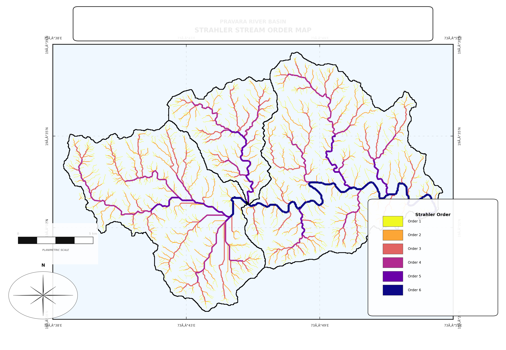

Orders 1–6 · 3,610 segments · *Section 4*

</td>
<td align="center" width="25%">

**RUSLE Soil Loss**

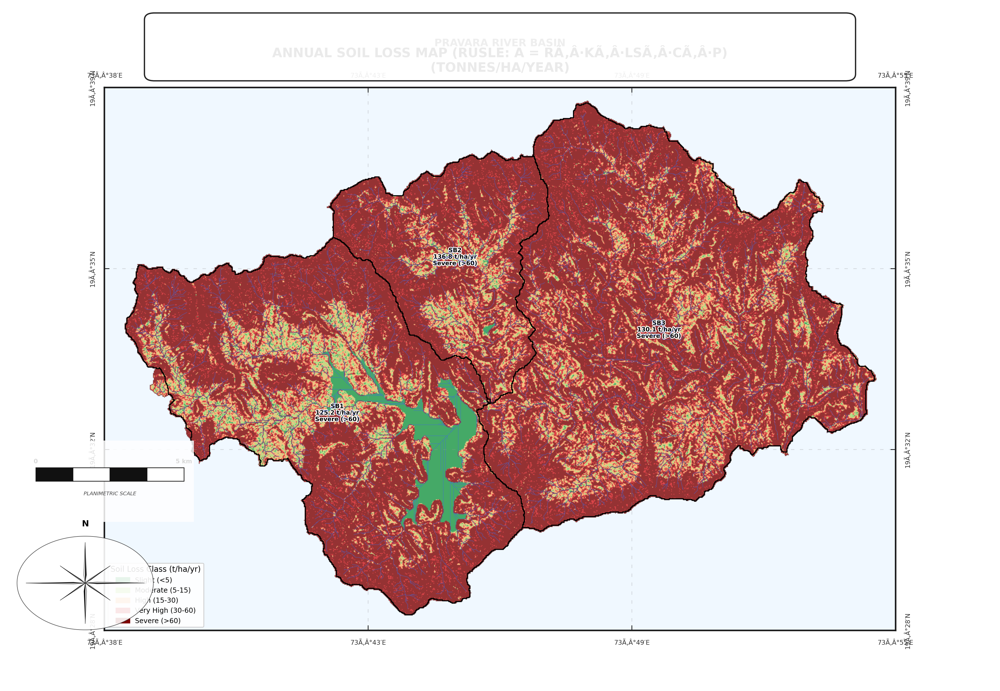

Mean **168 t/ha/yr** · Severe class · *Section 15*

</td>
<td align="center" width="25%">

**Check Dam Suitability**

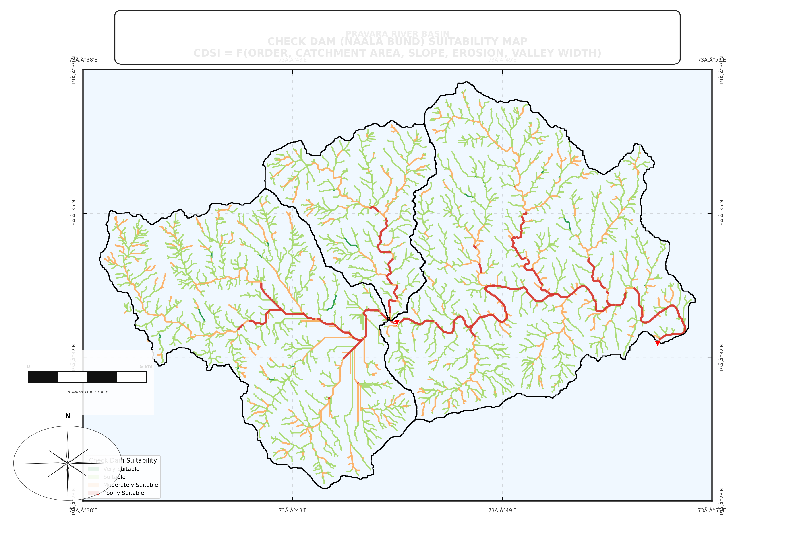

73.8% network Suitable+ · *Section 16*

</td>
<td align="center" width="25%">

**Channel Stability**

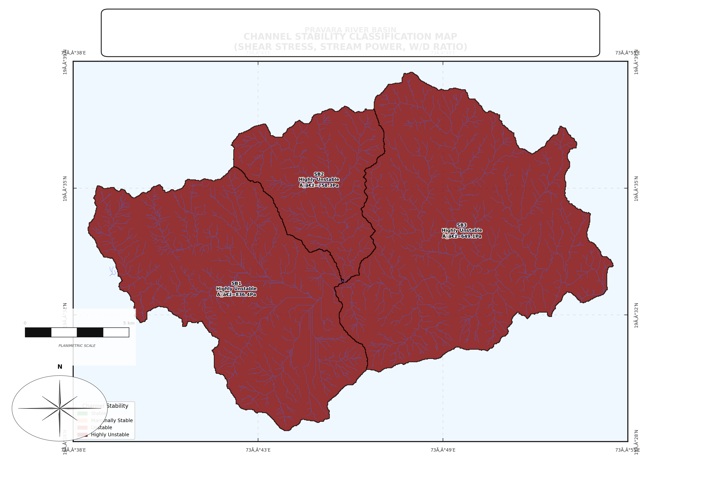

All basins Highly Unstable · *Section 18*

</td>
</tr>
<tr>
<td align="center">

**Flood Hazard Composite**

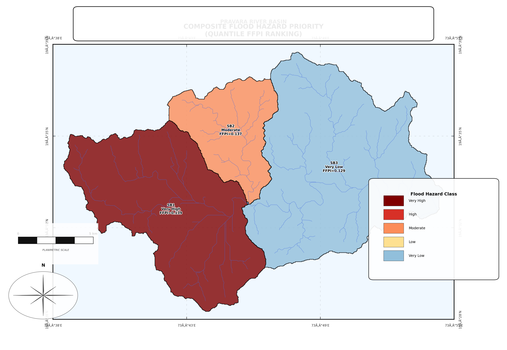

FFPI + TWI + morphometry · *Section 13*

</td>
<td align="center">

**Curve Number Map**

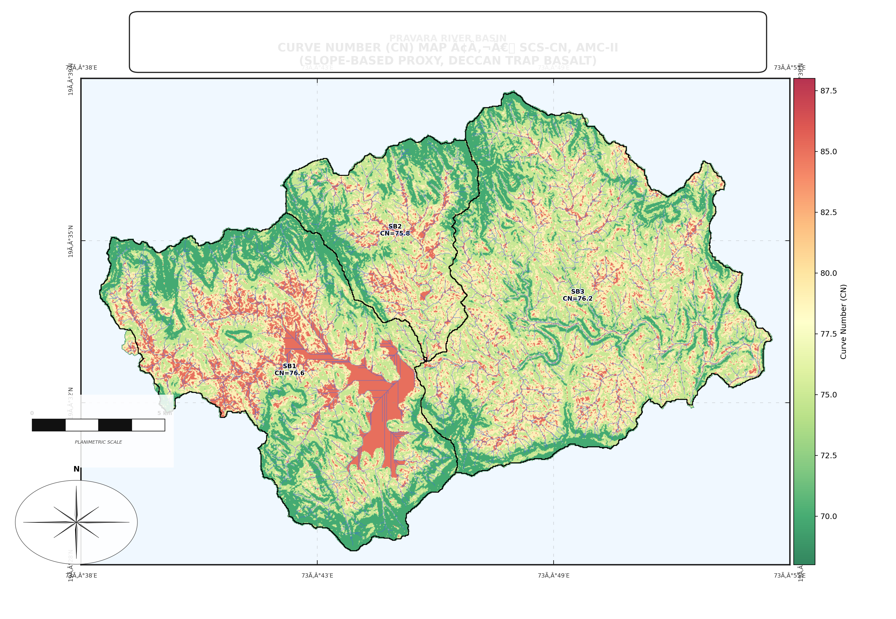

CN 70–85 · Mean 76.2 · *Section 14*

</td>
<td align="center">

**TWI — Wetness Index**

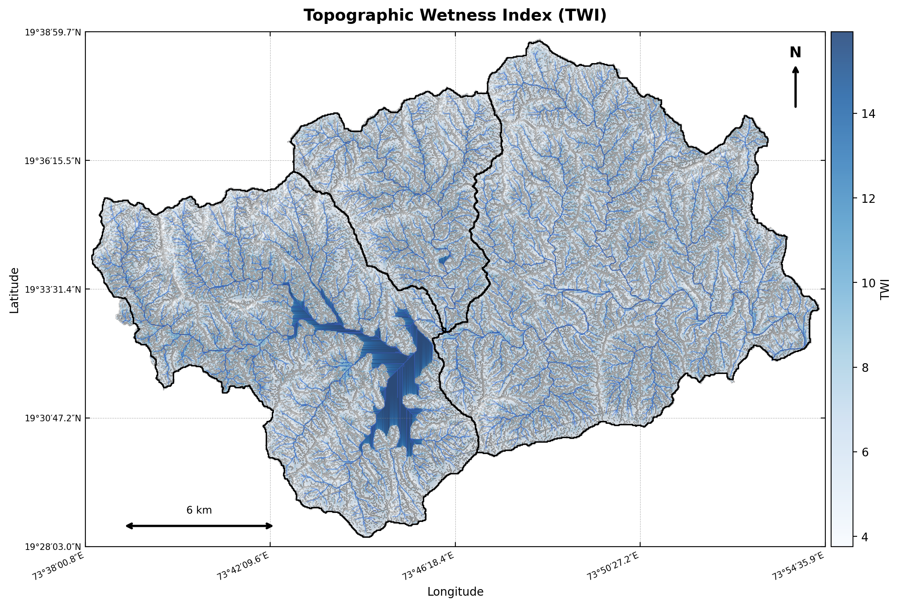

Mean 6.8–7.7 · Max 24.8 · *Section 13*

</td>
<td align="center">

**SWC Treatment Zones**

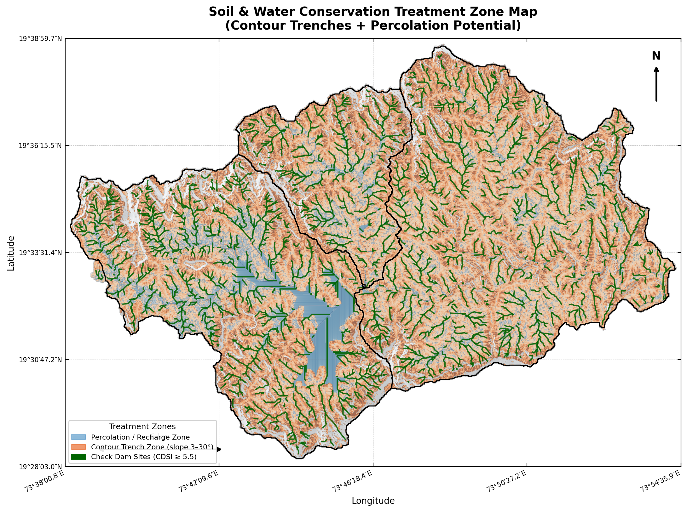

Percolation · Trenches · Check dams · *Section 16*

</td>
</tr>
<tr>
<td align="center">

**Elevation (DEM)**

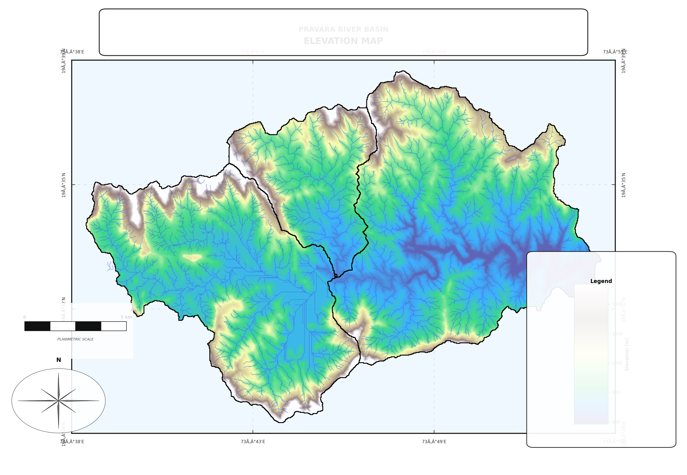

584–1,537 m · SRTM 30 m · *Section 4*

</td>
<td align="center">

**Slope Map**

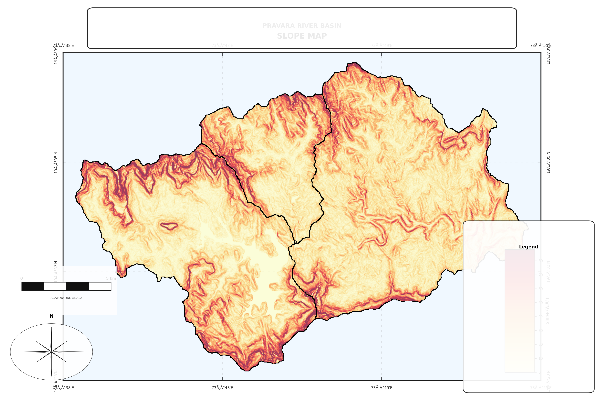

Gradient in degrees · *Section 4*

</td>
<td align="center">

**Tectonic Activity (IAT)**

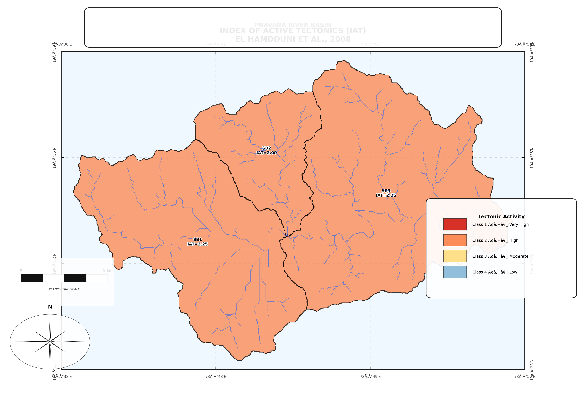

Index of Active Tectonics · *Section 10*

</td>
<td align="center">

**FFPI Map**

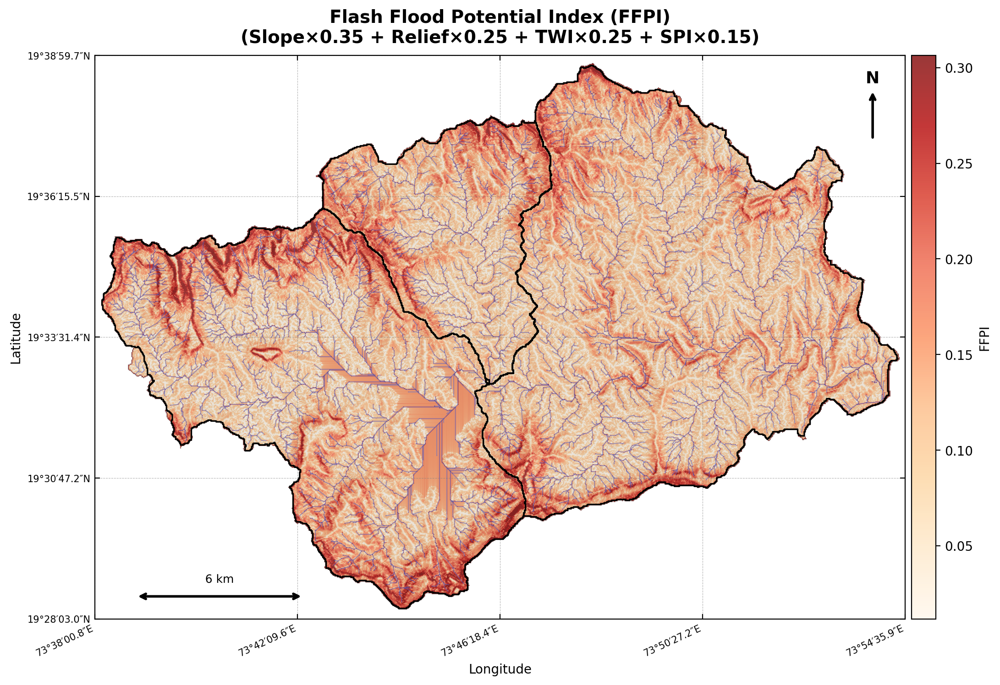

Flash Flood Potential Index · *Section 13*

</td>
</tr>
</table>

*➡️ [View all 26 maps →](outputs/maps/README.md)*

---

## 📊 Interactive Charts

> **36 Plotly HTML charts** — open locally in any browser · Full index → [`outputs/html/README.md`](outputs/html/README.md)

| Chart | Type | Key Finding |
|-------|:----:|-------------|
| [`07_hypsometric_curves.html`](outputs/html/07_hypsometric_curves.html) | 📈 Line | **FIXED** — Per-basin HI: SB1=0.249, SB2=0.267, SB3=0.222 |
| [`elevation_profile_W2E.html`](outputs/html/elevation_profile_W2E.html) | 📈 Line | **NEW** — West→East transect at basin centroid |
| [`elevation_profile_E2W.html`](outputs/html/elevation_profile_E2W.html) | 📈 Line | **NEW** — East→West transect at basin centroid |
| [`elevation_profile_N2S.html`](outputs/html/elevation_profile_N2S.html) | 📈 Line | **NEW** — North→South transect at basin centroid |
| [`elevation_profile_S2N.html`](outputs/html/elevation_profile_S2N.html) | 📈 Line | **NEW** — South→North transect at basin centroid |
| [`elevation_profiles_4dir.html`](outputs/html/elevation_profiles_4dir.html) | 📊 Subplot | **NEW** — Combined 4-directional view per basin |
| [`elevation_histograms.html`](outputs/html/elevation_histograms.html) | 📊 Histogram | **NEW** — Pixel-level elevation distributions |
| [`elevation_histograms_per_basin.html`](outputs/html/elevation_histograms_per_basin.html) | 📊 Histogram | **NEW** — Per-basin distributions with stats |
| [`elevation_statistics_table.html`](outputs/html/elevation_statistics_table.html) | 📋 Table | **NEW** — Min/Max/Mean/Std/HI summary |
| [`14c_flood_frequency_curves.html`](outputs/html/14c_flood_frequency_curves.html) | 📈 Line | Qp₂₅ reaches **1,736 m³/s** (SB3) |
| [`17b_synthetic_unit_hydrographs.html`](outputs/html/17b_synthetic_unit_hydrographs.html) | 📈 Line | W₅₀ = 6.6–9.7 hr · tp = 5.1–7.3 hr |
| [`18c_stream_power_hydraulics.html`](outputs/html/18c_stream_power_hydraulics.html) | 🫧 Bubble | ω by order: 11.8 → **189 W/m²** |
| [`15c_RUSLE_erosion_bars.html`](outputs/html/15c_RUSLE_erosion_bars.html) | 📊 Bar | Total: **1.21 million t/yr** |
| [`02_radar_morphometric.html`](outputs/html/02_radar_morphometric.html) | 🕸️ Radar | SB1 clearly most degraded |
| [`08_correlation_heatmap.html`](outputs/html/08_correlation_heatmap.html) | 🗺️ Heatmap | Full parameter correlation matrix |
| [`11_priority_map.html`](outputs/html/11_priority_map.html) | 🗺️ Choropleth | Interactive priority classification |

*➡️ [View all 36 charts →](outputs/html/README.md)*

---

## 🏗️ Pipeline Architecture

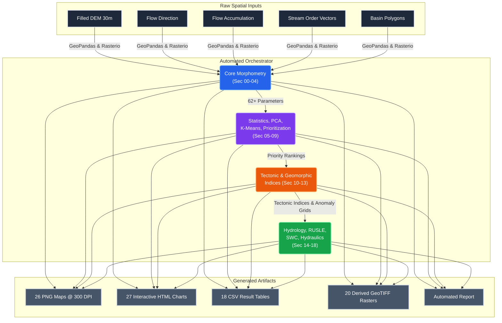
```mermaid
graph TD
    classDef input fill:#1e293b,stroke:#e2e8f0,stroke-width:2px,color:#fff
    classDef core fill:#2563eb,stroke:#60a5fa,stroke-width:2px,color:#fff
    classDef geomorph fill:#ea580c,stroke:#fdba74,stroke-width:2px,color:#fff
    classDef hydro fill:#16a34a,stroke:#86efac,stroke-width:2px,color:#fff
    classDef ml fill:#7c3aed,stroke:#c4b5fd,stroke-width:2px,color:#fff
    classDef output fill:#475569,stroke:#cbd5e1,stroke-width:2px,color:#fff

    subgraph "Raw Spatial Inputs"
        A1[Filled DEM 30m]:::input
        A2[Flow Direction]:::input
        A3[Flow Accumulation]:::input
        A4[Stream Order Vectors]:::input
        A5[Basin Polygons]:::input
    end

    A1 & A2 & A3 & A4 & A5 -->|GeoPandas & Rasterio| B1

    subgraph "Automated Orchestrator"
        B1("Core Morphometry<br/>(Sec 00-04)"):::core
        B1ML("Statistics, PCA,<br/>K-Means, Prioritization<br/>(Sec 05-09)"):::ml
        B2("Tectonic & Geomorphic<br/>Indices (Sec 10-13)"):::geomorph
        B3("Hydrology, RUSLE,<br/>SWC, Hydraulics<br/>(Sec 14-18)"):::hydro
        B1 -->|62+ Parameters| B1ML
        B1ML -->|Priority Rankings| B2
        B2 -->|Tectonic Indices & Anomaly Grids| B3
    end

    subgraph "Generated Artifacts"
        C1[26 PNG Maps @ 300 DPI]:::output
        C2[27 Interactive HTML Charts]:::output
        C3[18 CSV Result Tables]:::output
        C4[20 Derived GeoTIFF Rasters]:::output
        C5[Automated Report]:::output
    end

    B1 & B1ML & B2 & B3 --> C1 & C2 & C3 & C4 & C5
```

---

## 📑 18-Section Pipeline Reference

<details>
<summary><strong>🔵 Module 1 — Core Morphometry (Sections 0–9)</strong></summary>

| Sec | Title | Outputs |
|:---:|-------|---------|
| 00 | ZIP Extraction & File Discovery | Auto-detected GIS layers |
| 01 | Environment Setup & Library Imports | 30+ packages configured |
| 02 | Data Paths & Preprocessing | Reprojected rasters, validated vectors |
| 03 | Morphometric Parameter Computation | 62+ linear, areal, relief parameters |
| 04 | Publication-Grade Maps | 9 maps (DEM, slope, aspect, streams, etc.) |
| 05 | Statistical Analysis | Descriptive stats, VIF, PCA, K-Means clustering |
| 06 | Watershed Prioritization | 3-method ranking (Compound, Entropy, PCA-based) |
| 07 | Interactive Plotly Charts | 12 HTML charts (radar, scatter, hypsometric, etc.) |
| 08 | Output Export | Master CSV, stream order summary, ranking tables |
| 09 | Automated Report Generation | Structured text report for publication drafting |

</details>

<details>
<summary><strong>🟠 Module 2 — Geomorphic & Tectonic Analysis (Sections 10–13)</strong></summary>

| Sec | Title | Key Methods |
|:---:|-------|-------------|
| 10 | Tectonic Activity Indices | Bs (Basin Shape), Af (Asymmetry Factor), Vf (Valley Floor), Smf (Mountain Front Sinuosity), IAT |
| 11 | Geomorphic Indices | SL (Stream Length-gradient), SPI (Stream Power Index), TWI (Topographic Wetness), STI (Sediment Transport) |
| 12 | Geomorphic Anomaly & Lineaments | GAI raster, lineament proxy, sinuosity mapping |
| 13 | Flood Hazard Indicators | FFPI (Flash Flood Potential Index), composite flood hazard priority |

</details>

<details>
<summary><strong>🟢 Module 3 — Hydrology & Soil-Water Conservation (Sections 14–18)</strong></summary>

| Sec | Title | Key Methods |
|:---:|-------|-------------|
| 14 | Rainfall–Runoff Analysis | Gumbel EV-I frequency, SCS-CN method, runoff volume estimation |
| 15 | RUSLE Soil Erosion Model | R·K·LS·C·P factor computation, pixel-level soil loss mapping |
| 16 | Conservation Planning | Check dam CDSI, percolation ponds, contour trenches, WHP |
| 17 | Synthetic Unit Hydrograph | Snyder's method, Deccan-calibrated Ct/Cp, design flood |
| 18 | Channel Hydraulics | Leopold-Maddock geometry, Manning's equation, shear stress, stream power, stability classification |

</details>

---

## ⚡ Quick Start

### Google Colab (Recommended)

[](https://colab.research.google.com/github/Satwik-1234/Pravara-River-Basin-Advanced-Morphometric-Hydrological-Analysis/blob/main/notebooks/Adv_v2__Final_morphometry_pravrabasin.ipynb)

```python
# 1. Clone
!git clone https://github.com/Satwik-1234/Pravara-River-Basin-Advanced-Morphometric-Hydrological-Analysis.git
%cd Pravara-River-Basin-Advanced-Morphometric-Hydrological-Analysis

# 2. Install
!pip install -r requirements.txt --quiet

# 3. Upload your zip to Colab /content/ then run sections 00 → 18
%run scripts/section_00_zip_extraction.py
# ... continue section_01 through section_18
```

### Local Python (Automated Pipeline)

```bash
git clone https://github.com/Satwik-1234/Pravara-River-Basin-Advanced-Morphometric-Hydrological-Analysis.git
cd Pravara-River-Basin-Advanced-Morphometric-Hydrological-Analysis

make install        # install dependencies
make pipeline       # run all 18 sections
make test           # run unit tests (8/8 passing)
make lint           # check formatting (black + isort + flake8)
make format         # auto-format code
```

### Input Files Required

| File | Type | Description |
|------|:----:|-------------|
| `Filled DEM.tif` | 🗺️ Raster | Hydrologically filled SRTM 30 m DEM |
| `Flow Direction.tif` | 🗺️ Raster | D8 flow direction |
| `FlowAccumilation.tif` | 🗺️ Raster | D8 flow accumulation |
| `SteamOrder.shp` | 📐 Vector | Stream network (field: `grid_code`) |
| `Pourpoints_3.shp` | 📐 Vector | 3 pour-point outlets |
| `Pravrabasin.shp` | 📐 Vector | Subbasin polygons |

→ [Full data guide](docs/DATA_REQUIREMENTS.md)

---

## 📂 Repository Structure

```
Pravara-River-Basin-Advanced-Morphometric-Hydrological-Analysis/
│
├── 📜 scripts/
│   ├── adv_v2_morphometry_pravra3basin.py   ← Sections 0–13 (5,291 lines)
│   ├── sections_14_18_hydrology_swc.py      ← Sections 14–18 (2,417 lines)
│   ├── run_pipeline.py                      ← Master orchestrator
│   └── section_00...section_18_*.py         ← Modular section stubs
│
├── 📓 notebooks/
│   └── Adv_v2__Final_morphometry_pravrabasin.ipynb
│
├── 📦 data/
│   ├── Morphomtery_layers-Final.zip         ← GIS input bundle
│   └── README.md
│
├── 📊 outputs/
│   ├── maps/            ← 26 PNG maps @ 300 DPI
│   ├── html/            ← 27 interactive Plotly charts
│   ├── tables/          ← 18 CSV result tables
│   ├── hydrology/       ← Sections 14–18 CSVs
│   ├── conservation/    ← SWC planning outputs
│   ├── unit_hydrograph/ ← Snyder UH results
│   ├── shapefiles/      ← Exported GIS layers
│   └── *.tif            ← 20 derived GeoTIFF rasters
│
├── 📖 docs/
│   ├── PARAMETERS_REFERENCE.md   ← All 62+ parameter definitions
│   ├── DATA_REQUIREMENTS.md      ← Input data specifications
│   ├── RESULTS_INTERPRETATION.md ← Guide to interpreting outputs
│   └── methodology/              ← RUSLE · SCS-CN · Snyder UH
│
├── 🧪 tests/
│   └── test_morphometry.py       ← 8 unit tests (SCS-CN, Kirpich, RUSLE)
│
├── ⚙️  .github/workflows/ci.yml  ← CI pipeline (lint + test + geospatial)
├── 📋 pyproject.toml              ← black + isort config
├── 📋 .flake8                     ← flake8 per-file-ignores
├── 📋 Makefile                    ← install/lint/test/pipeline targets
├── 📋 requirements.txt           ← Production dependencies
├── 📋 requirements-dev.txt       ← Dev dependencies (pytest, black, etc.)
├── 📋 CHANGELOG.md               ← Version history
├── 📋 CONTRIBUTING.md            ← Contribution guidelines
└── 📋 LICENSE                     ← MIT License
```

---

## 🧰 Tech Stack

| Category | Libraries | Purpose |
|----------|-----------|---------|
| **GIS & Raster** | `geopandas`, `rasterio`, `shapely`, `pyproj`, `fiona`, `GDAL` | Vector/raster I/O, CRS transforms, spatial ops |
| **Analysis** | `numpy`, `scipy`, `pandas` | Numerical computation, statistics |
| **Machine Learning** | `scikit-learn`, `statsmodels` | PCA, K-Means, VIF, Kendall's τ |
| **Visualisation** | `matplotlib`, `plotly`, `seaborn`, `kaleido` | Static maps, interactive HTML charts |
| **Reports** | `reportlab`, `jinja2`, `Pillow` | Automated report generation |
| **Dev & CI** | `pytest`, `black`, `isort`, `flake8`, GitHub Actions | Testing, formatting, linting |

---

## 🧪 Running Tests

```bash
# Unit tests only (no GDAL needed) — 8/8 passing
pytest tests/ -v

# With coverage report
pytest tests/ -v --cov=. --cov-report=term-missing

# Full lint check
make lint
```

**Test coverage includes:**

| Test Class | Tests | Coverage |
|-----------|:-----:|---------|
| `TestSCSCN` | 4 | SCS-CN runoff: zero runoff below Iₐ, monotonic increase with P and CN, Deccan calibration range |
| `TestKirpich` | 2 | Kirpich Tc: positivity, monotonic increase with channel length |
| `TestRUSLE` | 2 | LS-factor positivity, bounded erosion on flat terrain |

---

## 🔁 Results Reproducibility

All results in this repository are fully reproducible:

1. **Input data** is included in `data/Morphomtery_layers-Final.zip`
2. **Pipeline** is deterministic (fixed random seeds for K-Means)
3. **CI pipeline** validates linting, tests, and geospatial imports on every push
4. **Three Python versions** tested: 3.9, 3.10, 3.11

```bash
# Reproduce from scratch
git clone https://github.com/Satwik-1234/Pravara-River-Basin-Advanced-Morphometric-Hydrological-Analysis.git
cd Pravara-River-Basin-Advanced-Morphometric-Hydrological-Analysis
make install && make pipeline
```

---

## 📚 References

<details>
<summary><strong>Click to expand full bibliography</strong></summary>

| Method | Reference |
|--------|-----------|
| Stream ordering | Horton, R.E. (1945). *Erosional development of streams.* GSA Bulletin, 56(3), 275–370 |
| Hierarchical classification | Strahler, A.N. (1952). *Hypsometric analysis.* GSA Bulletin, 63(11), 1117–1142 |
| Quantitative geomorphology | Strahler, A.N. (1964). In *Handbook of Applied Hydrology* (Chow, ed.) |
| Basin geometry | Schumm, S.A. (1956). *Evolution of drainage systems.* GSA Bulletin, 67(5), 597–646 |
| Circularity ratio | Miller, V.C. (1953). *Quantitative geomorphic study.* Columbia Univ. Tech. Rep. |
| Topographic index | Moore, I.D. et al. (1991). *Digital terrain modelling.* Hydrological Processes, 5(1), 3–30 |
| SCS curve number | USDA-SCS (1985). *National Engineering Handbook, Section 4* |
| RUSLE erosion | Wischmeier, W.H. & Smith, D.D. (1978). *Predicting rainfall erosion losses.* USDA Handbook 537 |
| Synthetic UH | Snyder, F.F. (1938). *Synthetic unit-graphs.* Transactions AGU, 19, 447–454 |
| Time of concentration | Kirpich, Z.P. (1940). Civil Engineering, 10(6), 362 |
| Hydraulic geometry | Leopold, L.B. & Maddock, T. (1953). *Hydraulic geometry of stream channels.* USGS Prof. Paper 252 |
| Stream power | Bagnold, R.A. (1966). *An approach to the sediment transport problem.* USGS Prof. Paper 422-I |
| Tectonic activity | El Hamdouni, R. et al. (2008). *Assessment of relative active tectonics.* Geomorphology, 96, 150–173 |
| Stream-length gradient | Hack, J.T. (1957). *Longitudinal stream profiles.* USGS Prof. Paper 294-B |
| Sediment yield | Renfro, G.W. (1975). *SDR equations for steep catchments.* USDA-ARS |

</details>

→ [Full bibliography](docs/README.md)

---

## 🤝 Contributing

See [CONTRIBUTING.md](CONTRIBUTING.md) for guidelines.

```bash
# Before opening a PR:
make format         # auto-format with black + isort
make lint           # verify formatting
make test           # run all 8 unit tests
```

---

## 👨‍💻 Author & Credits

<table>
<tr>
<td>

**Satwik K. Udupi**

*Junior Research Fellow*

Centre for Climate Change and Sustainability Studies (CCCSS)\
Shivaji University, Kolhapur, Maharashtra, India

[](https://github.com/Satwik-1234)

</td>
</tr>
</table>

---

<div align="center">

*Made with 🐍 Python · 🗺️ GDAL · 📊 Plotly · 🤖 scikit-learn*

*Pravara River Basin · Maharashtra · India · 312 km² · 18 Sections · 7,000+ Lines of Code*

**[⬆ back to top](#)**

</div>
