

# 🗺️ Maps Gallery
### Pravara River Basin · 26 Publication-Grade Maps @ 300 DPI

*UTM Zone 43N · EPSG:32643 · Generated by the 18-section analysis pipeline*

[← Back to Main README](../../README.md) &nbsp;·&nbsp;
[📊 Interactive Charts](../html/README.md) &nbsp;·&nbsp;
[📋 Results Tables](../../docs/RESULTS.md)

---

All maps are generated at **300 DPI** in **UTM Zone 43N** (EPSG:32643) projection.
Hillshade background derived from SRTM 30 m DEM.

---

## 🔵 Section 4 — Core DEM & Drainage Maps

These nine foundational maps characterise the terrain and drainage network of the Pravara Basin.

<table>
<tr>
<td align="center" width="33%">

### 01 · Elevation (DEM)
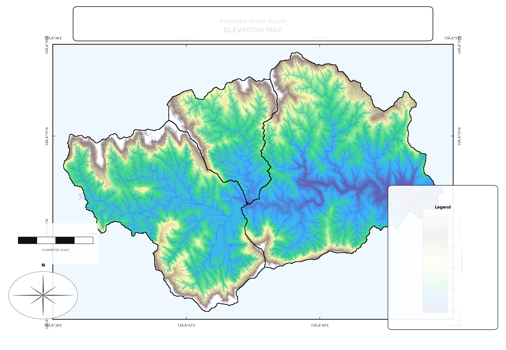

SRTM filled DEM · 584–1 537 m
Hillshade-draped colour ramp

</td>
<td align="center" width="33%">

### 02 · Slope
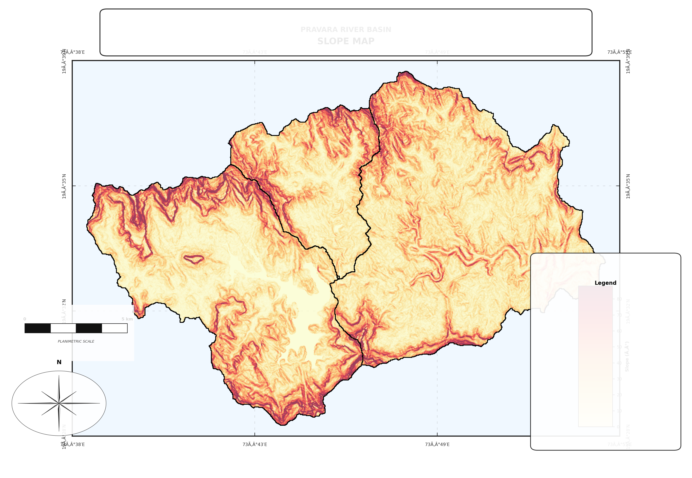

0°–88.4° continuous scale
Mean slope: **13.3°** across basin

</td>
<td align="center" width="33%">

### 03 · Aspect
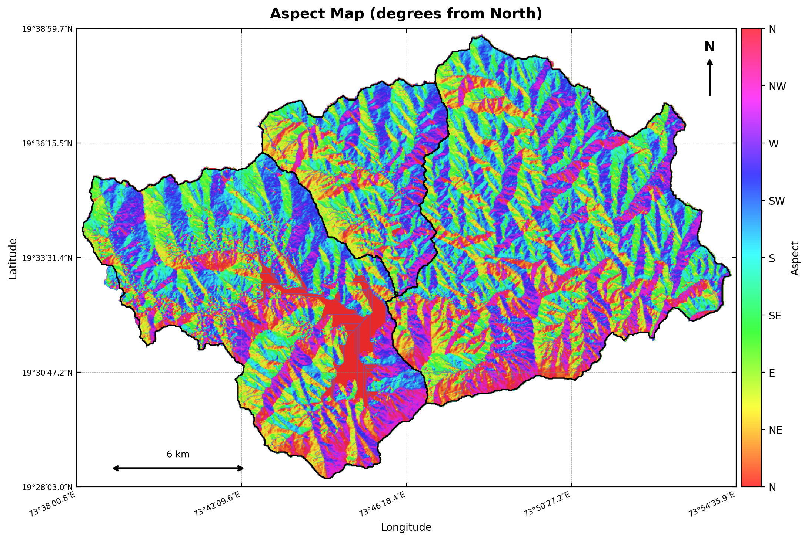

N/NE-facing dominant in upper
basin (controls erosion regime)

</td>
</tr>
<tr>
<td align="center">

### 04 · Flow Direction
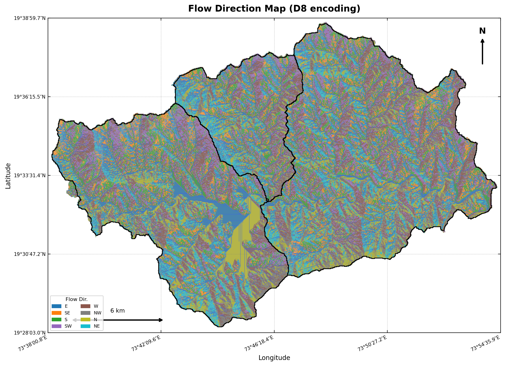

D8 algorithm · 8 cardinal directions
Basis for stream network extraction

</td>
<td align="center">

### 05 · Flow Accumulation
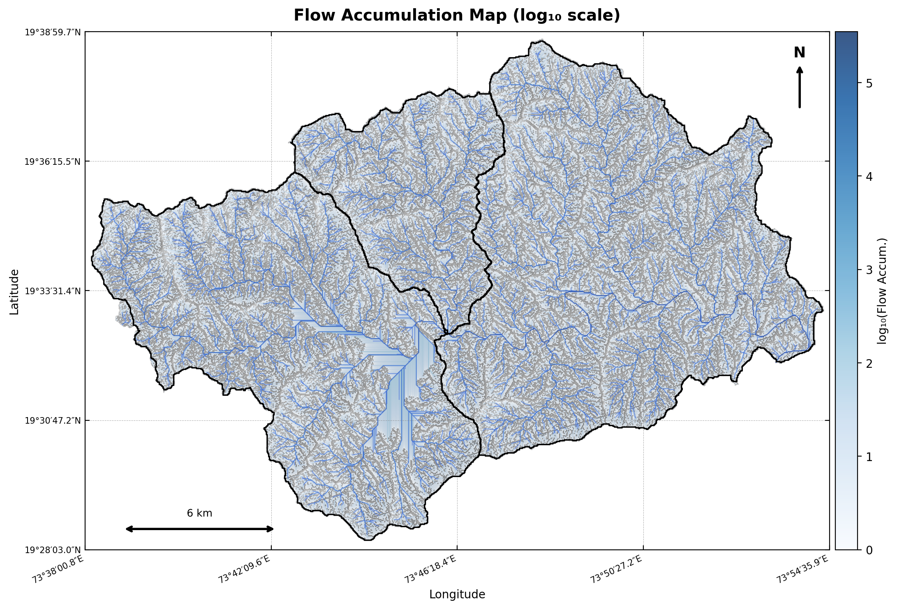

Log-scaled · High values = main channels
Threshold used: 100 cells → stream

</td>
<td align="center">

### 06 · Stream Order Network

Strahler orders 1–6 · 3 610 segments
Coloured 1st (thin) → 6th (thick)

</td>
</tr>
<tr>
<td align="center">

### 07 · Drainage Density
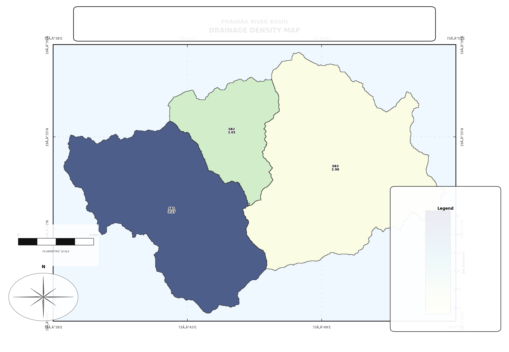

Dd: 2.98–3.26 km/km²
SB1 highest (most dissected)

</td>
<td align="center">

### 08 · Contour Map
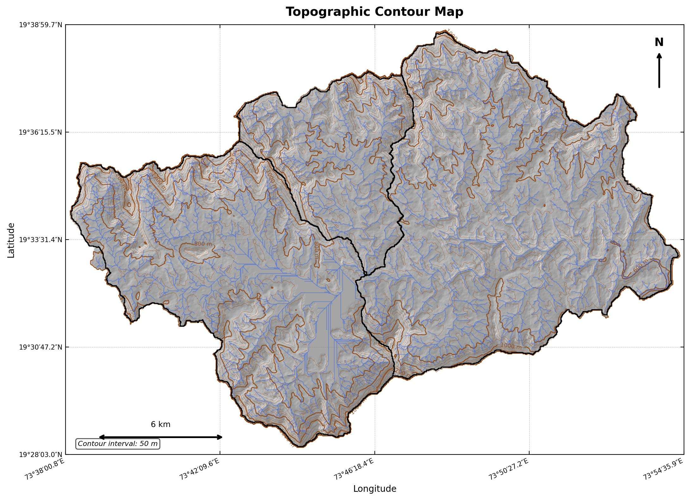

50 m interval contours
Overlaid on hillshade DEM

</td>
<td align="center">

### 09 · Pour Points (Snapped)

3 pour points snapped to max
flow accumulation cells

</td>
</tr>
</table>

---

## 🟠 Section 10 — Tectonic Activity

<table>
<tr>
<td align="center" width="50%">

### 10a · Tectonic IAT Map
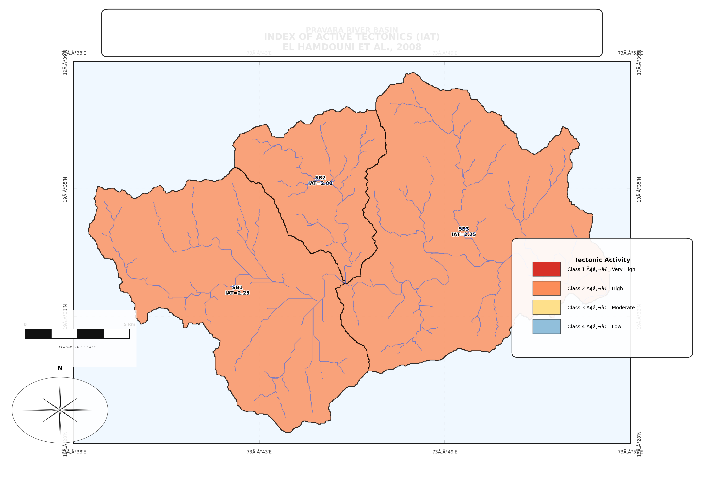

**Index of Active Tectonics (IAT):**
- SB1 = Class 2 — High
- **SB2 = Class 1 — Very High** ⚠️
- SB3 = Class 4 — Low

*El Hamdouni et al. (2008) classification*

</td>
<td align="center" width="50%">

**⚠️ Engineering Implication**

SB2's Class 1 tectonic rating means:
- Slope failure risk is elevated
- Avoid large dam structures in SB2
- Use distributed small check dams (<3 m height)
- Monitor for slope instability after heavy rainfall events

*→ [Tectonic methodology](../../docs/methodology/)*

</td>
</tr>
</table>

---

## 🟡 Section 12 — Geomorphic Anomaly & Lineaments

<table>
<tr>
<td align="center" width="33%">

### 12a · Geomorphic Anomaly Index (GAI)
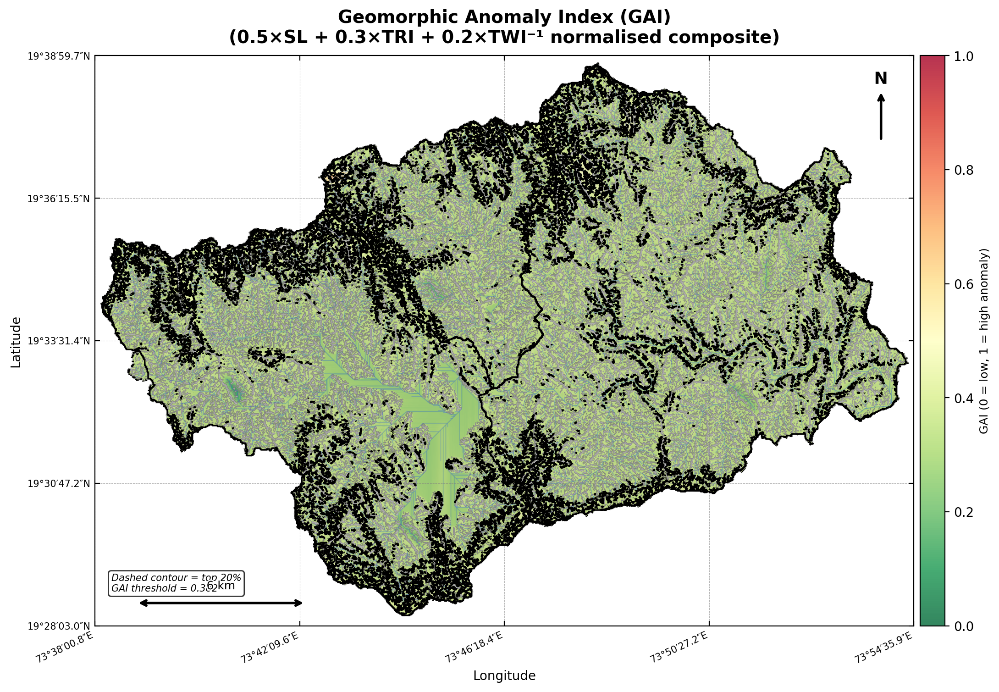

High GAI zones = active incision
or knickpoint migration fronts

</td>
<td align="center" width="33%">

### 12b · Lineament Proxy Map
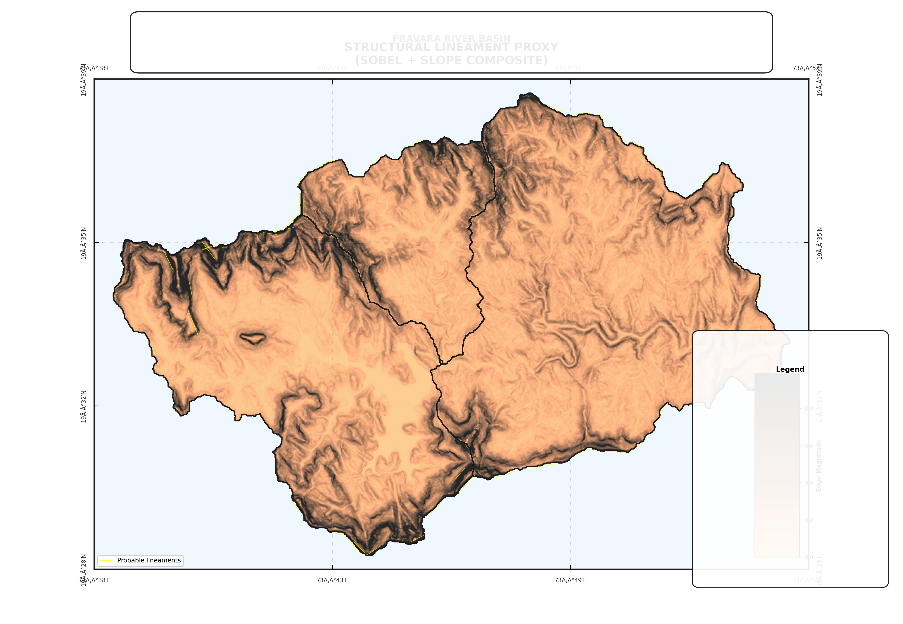

Structural lineaments from DEM
directional filtering

</td>
<td align="center" width="33%">

### 12c · Channel Sinuosity Map
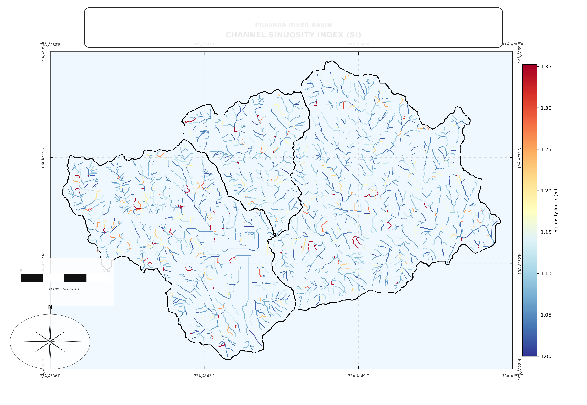

SI mean: **1.053** (Irregular class)
across all three subbasins

</td>
</tr>
</table>

---

## 🔴 Section 13 — Flood Hazard

<table>
<tr>
<td align="center" width="50%">

### 13a · Topographic Wetness Index (TWI)

| Basin | TWI Mean | TWI Max |
|:---:|:---:|:---:|
| SB1 | **7.685** | 23.84 |
| SB2 | 6.822 | 22.60 |
| SB3 | 6.878 | **24.82** |

*High TWI zones = percolation pond sites*

</td>
<td align="center" width="50%">

### 13b · Stream Power Index (SPI)
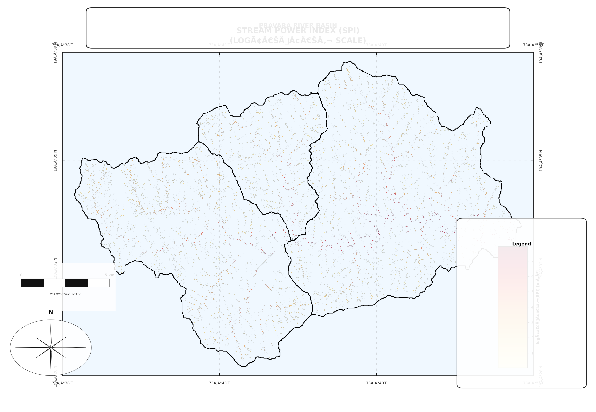

| Basin | SPI Mean |
|:---:|:---:|
| SB1 | 252 497 |
| SB2 | 274 669 |
| **SB3** | **2 295 745** |

*SB3 has 9× higher erosive stream power*

</td>
</tr>
<tr>
<td align="center">

### 13c · Sediment Transport Index (STI)
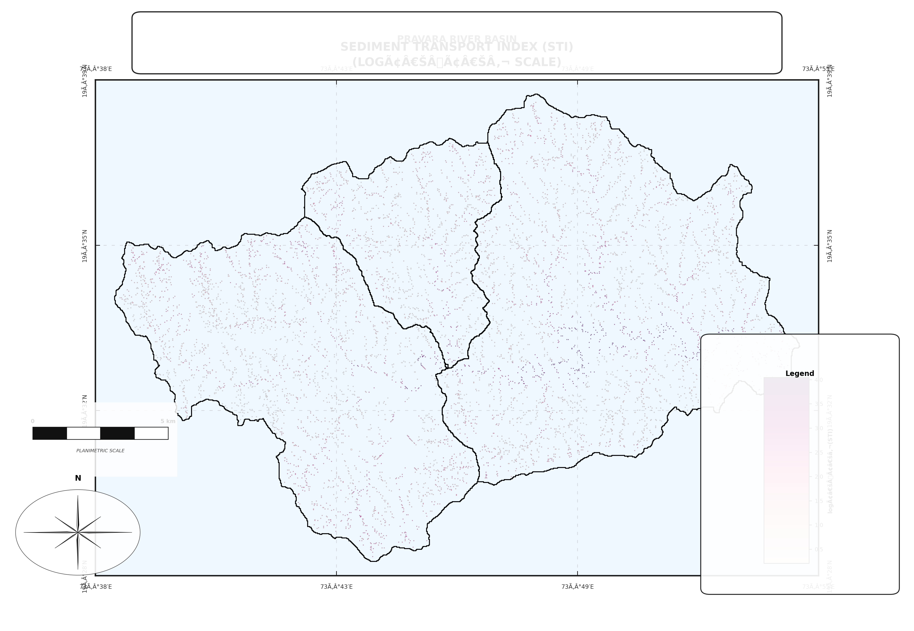

STI = (As/22.13)^0.6 × sin(β)^1.3
SB3 mean = **75 686** vs SB1 = 8 324

</td>
<td align="center">

### 13d · Flood Potential Index (FFPI)
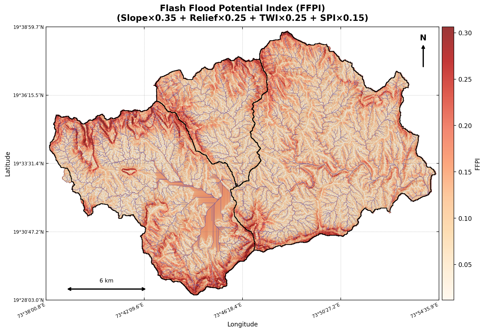

Combined runoff, slope, and
drainage density flood score

</td>
</tr>
</table>

### 13e · Flood Hazard Composite Map *(Key Output)*

*Composite of FFPI + TWI + Dd + Relief Ratio — identifies high-risk flood zones for land use planning*

---

## 💧 Section 14 — SCS-CN Runoff

<table>
<tr>
<td align="center" width="50%">

### 14a · Curve Number Map

**Slope-based SCS Curve Number (AMC-II)**

| CN | Slope | Soil Type |
|:---:|:---:|:---|
| **85** | <3° | Deep Vertisol (flat cultivated) |
| **79** | 3–8° | Vertic Inceptisol |
| **75** | 8–20° | Shallow Alfisol |
| **70** | >20° | Rock/Lithic soils |

Mean CN: **76.2** · Range: 70–85

</td>
<td align="center" width="50%">

### 14b · Runoff Volume Map (25-yr)
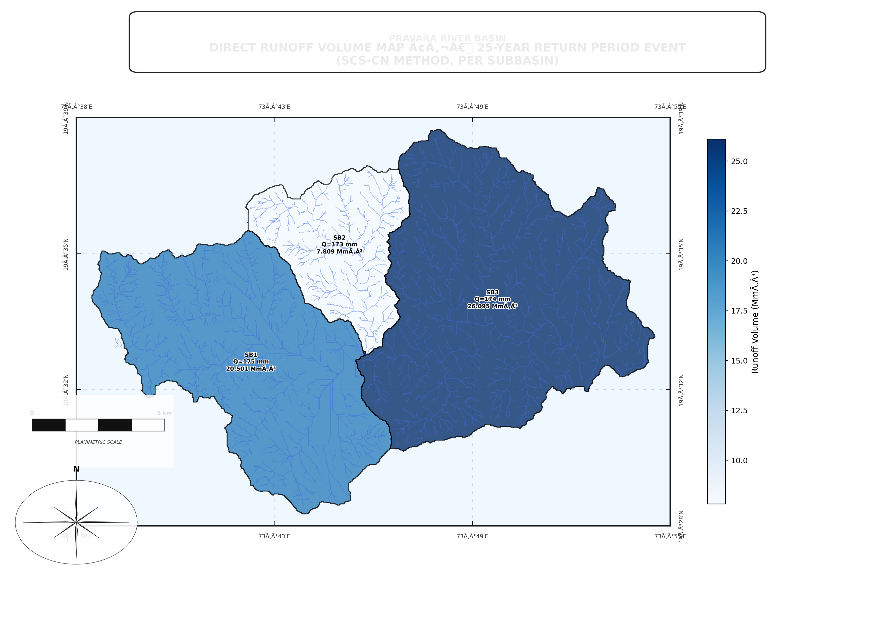

**Direct Runoff Q (SCS-CN) for 25-yr event**

| Basin | Q (mm) | Volume (Mm³) |
|:---:|:---:|:---:|
| SB1 | 175.2 | **20.50** |
| SB2 | 172.8 | **7.81** |
| SB3 | 174.0 | **26.10** |

*P₂₄ₕᵣ = 249.1 mm (Gumbel 25-yr, Ahmednagar)*

</td>
</tr>
</table>

---

## 🌱 Section 15 — RUSLE Soil Erosion

<table>
<tr>
<td align="center" width="50%">

### 15a · LS-Factor Map
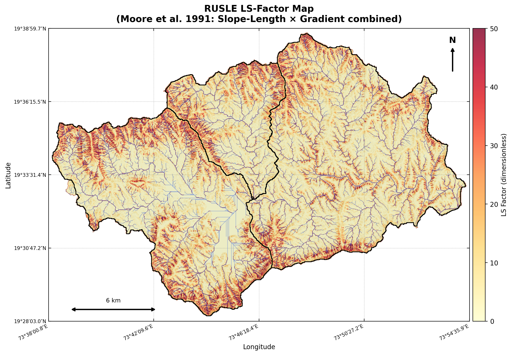

**Moore et al. (1991) formulation**
`LS = (As/22.13)^0.6 × (sinβ/0.0896)^1.3`

Range: 0–50 · Mean: **10.87**
High LS zones = steep convergent slopes

</td>
<td align="center" width="50%">

### 15b · RUSLE Annual Soil Loss *(Critical Output)*

**A = R · K · LS · C · P** [t/ha/yr]

| Class | Range | Basin Coverage |
|:---:|:---:|:---:|
| 🟩 Slight | <5 | Minimal |
| 🟨 Moderate | 5–15 | Small fraction |
| 🟧 High | 15–30 | Small fraction |
| 🟥 Very High | 30–60 | Significant |
| ⬛ **Severe** | **>60** | **Dominant** |

Mean: **168 t/ha/yr** — **33× India's tolerable limit**

</td>
</tr>
</table>

---

## 🛡️ Section 16 — Soil & Water Conservation

<table>
<tr>
<td align="center" width="50%">

### 16a · Check Dam Suitability Index (CDSI)

**CDSI = 0.30×Order + 0.25×Area + 0.20×Slope + 0.15×Erosion + 0.10×Vf**

| Class | Segments | % |
|:---:|:---:|:---:|
| 🟢 Very Suitable | 52 | 1.4% |
| 🔵 Suitable | **2 666** | **73.8%** |
| 🟡 Moderate | 669 | 18.5% |
| 🔴 Poor | 223 | 6.2% |

</td>
<td align="center" width="50%">

### 16b · SWC Treatment Zones *(Action Map)*

**Three treatment types mapped spatially:**

🔵 **Percolation zones** — High TWI flat areas
→ Farm ponds and percolation tanks

🟠 **Contour trench zones** — Slope 3–30°
→ Staggered trenches across the slope

🟢 **Check dam reaches** — Suitable+ CDSI
→ Naala bunds and gully plugs

</td>
</tr>
</table>

---

## 🌊 Section 18 — Stream Channel Hydraulics

<table>
<tr>
<td align="center" width="50%">

### 18a · Bankfull Hydraulic Geometry
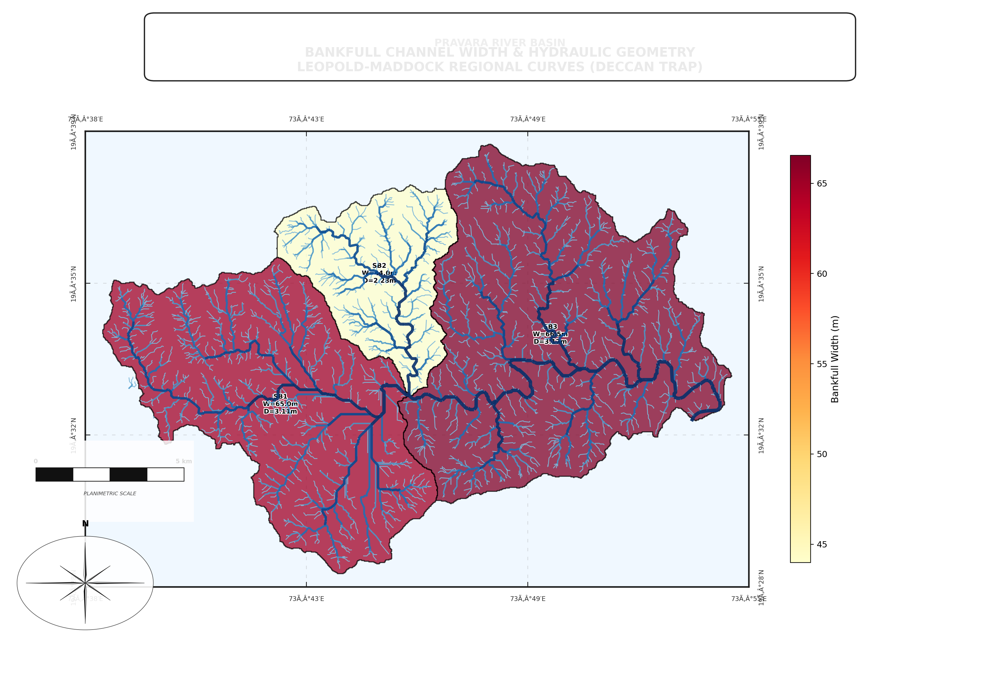

**Leopold-Maddock Power Laws (Deccan calibration)**

| Basin | W_bf (m) | D_bf (m) | Q_bf (m³/s) |
|:---:|:---:|:---:|:---:|
| SB1 | 84.2 | 3.83 | 692.5 |
| SB2 | 59.5 | 2.90 | 345.9 |
| SB3 | **89.7** | **4.03** | **785.0** |

*W = 3.2Q⁰·⁵ · D = 0.28Q⁰·⁴*

</td>
<td align="center" width="50%">

### 18b · Channel Stability Map *(Critical Output)*

**Combined W/D + τ excess + ω excess index**

All three basins: 🔴 **Highly Unstable**

| Parameter | Value | Critical | Ratio |
|:---:|:---:|:---:|:---:|
| τ₀ (Pa) | 2 400–3 125 | 10.3 | **250×** |
| ω (W/m²) | 7 099–8 584 | 35 | **216×** |
| W/D | 20–22 | <12 = stable | Unstable |

> **Gully stabilisation and bioengineering must precede check dam construction**

</td>
</tr>
</table>

---

[← Back to Main README](../../README.md) &nbsp;·&nbsp;
[📊 View Interactive Charts →](../html/README.md) &nbsp;·&nbsp;
[📋 View Full Results →](../../docs/RESULTS.md)

*All maps generated at 300 DPI · UTM Zone 43N · EPSG:32643*

